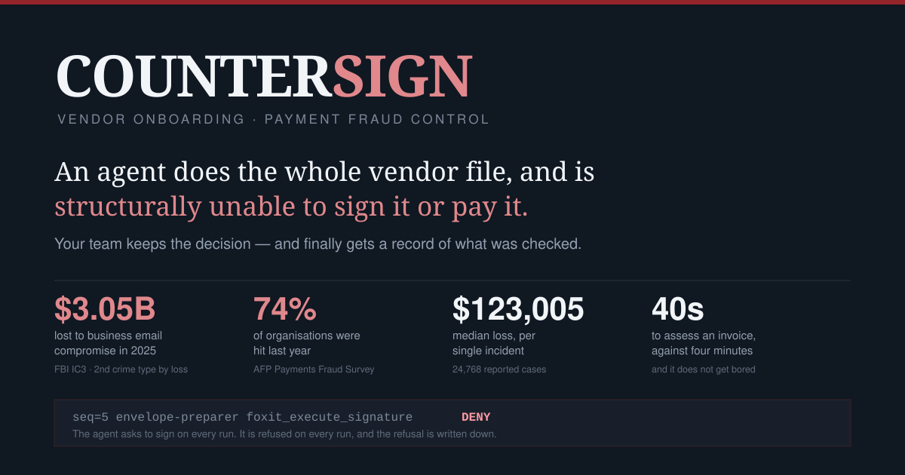
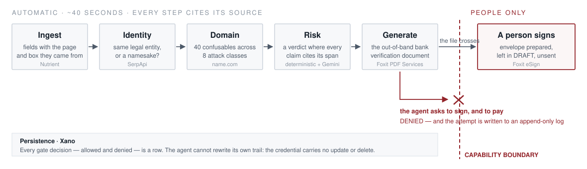

# COUNTERSIGN

**An agent does the whole vendor onboarding and contract file, and is structurally
unable to sign it or pay it.** Your team keeps the decision, and for the first time
gets an auditable record of what was actually checked.

Built for the [DevNetwork API + Cloud + AI Hackathon 2026](https://api-cloud-ai-hackathon-2026.devpost.com/).

---

## The problem, and what it costs

An invoice arrives from a domain one character off the real one, saying the vendor's
bank account has changed. The control that should stop it is a person in accounts
payable looking at a PDF for four minutes.

That gap moved **$3,046,598,558** in reported losses in 2025 — the second largest
crime category by loss in the FBI's IC3 report, across 24,768 complaints at a
**$123,005 median**. Three in four organisations were targeted. The FBI's Recovery
Asset Team froze 57% of what it chased, and only where victims noticed within hours.

The failure is not that people are careless. It is that the check is unreproducible
and leaves no trace:

- nobody compares the sender domain against the vendor's real one, because knowing
  the real one takes a search nobody runs under month-end pressure
- the bank-detail change is confirmed through the same email channel the attacker
  already controls
- afterwards, no record survives of what was checked, so there is nothing to audit
  and nothing to learn from

Manual invoice processing costs **$12.88–$19.83** per document on its own
(Ardent Partners, 2025). The verification that would actually catch this is not in
that number, because it mostly does not happen.

---

## What it does



Drop in an invoice. Seven stages run in about forty seconds and stop before the eighth.

| Stage | Provider | What it does |
|---|---|---|
| **Ingest** | Nutrient DWS | Deterministic parse. The model only maps spans that already exist onto named fields, and each field keeps the page and box it came from. A value it cannot anchor comes back **absent, never invented**. |
| **Identity** | SerpApi | Is this the same legal entity or a namesake? Is the coverage adverse? Is the invoiced address a business or a mail drop? |
| **Domain** | name.com | Forty confusable variants across eight attack classes, checked against the live registry. Which are already registered — and is the sender one of them? |
| **Risk** | deterministic + Gemini | Fuses the evidence into a verdict where **every claim cites the span it rests on**. A verdict whose claims cite nothing is rejected and retried. |
| **Generate** | Foxit PDF Services | Produces the out-of-band bank verification document — the thing that breaks the attacker's channel. |
| **Deliver** | Foxit eSign | Prepares the signature envelope and **stops**. |
| **Persist** | Xano | Vendors, workflow state, and an append-only audit log. |

### The claim, and why it is checkable

`execute_signature` and `release_payment` are not powers withheld by an instruction a
model could talk its way around. They are capabilities **no agent in the fleet holds**,
checked in [`fleet/capabilities.py`](src/countersign/fleet/capabilities.py). A tool that
is not declared resolves to no capability and is denied, so the gate **fails closed**
rather than granting an unnamed power.

The envelope preparer asks for the signature on every single run. It is refused every
single time, and the refusal is written to the audit log rather than hidden:

```
seq=5  envelope-preparer  foxit_execute_signature  deny
```

[`tests/test_boundary.py`](tests/test_boundary.py) fails if anyone ever grants an agent
the power to sign. [`tests/test_adversarial.py`](tests/test_adversarial.py) tries to
break it on purpose.

Foxit's own brief draws the same line: their MCP server offers 40 tools *"for the
reversible work"* and excludes signing from the toolset deliberately. **Reversible work
is delegated. Irreversible work is not.**

---

## Measured, not asserted

Six labelled invoices, every sender domain's registration status checked against the
production registry, two runs each.
[`demo/benchmark/measure.py`](demo/benchmark/measure.py) reproduces this end to end
against live APIs.

| Metric | Result | Why it is the metric |
|---|---|---|
| Verdict accuracy | **6/6** | including the two negatives: a real invoice must come back clear |
| Reproducibility | **6/6** | the same invoice twice must give the same verdict, or it cannot be trusted once |
| Sources matching retrieved evidence | **35/35** | every citation checked against what the run actually collected |
| Providers citing in verdicts | **3/3 (namecom, nutrient, serpapi)** | live data has to change the answer, not decorate it |
| Fabricated source rejected | **yes** | a draft citing evidence nobody collected is refused |
| Signature denied | **12/12** | asked on every run, refused on every run |
| Probes denied through the real gate | **4/4** | the probe raises if the gate lets it through, so a permissive gate breaks the benchmark |
| Human-only powers denied | **16/16** | every agent in the roster, against every reserved power |
| A granted call still allowed | **yes** | rules out the gate that passes by denying everything |
| Median latency | **40.4s** | against four minutes of a person's time |

**The two negatives matter as much as the four positives.** A control that flags
everything gets muted. `name.com` itself has 20 of 34 confusable variants registered,
and scoring that against an invoice that genuinely came from `name.com` would mark
every real invoice for review. `invoices.name.com` — a vendor's own billing subdomain —
must not score like `narne.com`, the attacker's homoglyph.

---

## A real run

```
ingest       completed  7 fields anchored, 1 absent
identity     completed  3 search credits spent
domain       completed  24 names checked, 8 confusables already registered
risk         completed  high at score 1.00 on 3 signals, from 17 evidence items
generation   completed  Bank verification - Name.com Inc rendered
delivery     completed  envelope 35674834 left in draft, awaiting a human signer
persistence  completed  10 audit rows written

  DENIED    envelope-preparer   foxit_execute_signature
```

Nothing there is mocked. The envelope exists in Foxit, in draft, unsent. The audit
rows are in Xano. The confusable count came from the live registry.

The worked case uses **name.com as the impersonated vendor** and `narne.com` as the
fraudulent sender — a real registered domain, and the `rn`/`m` substitution that is
indistinguishable at reading size. name.com is the party being impersonated, never the
perpetrator; the fraudster is fictional. We state registry facts only and never claim
that whoever holds `narne.com` is a criminal.

---

## Running it

```bash
uv venv --python 3.12 .venv
uv pip install --python .venv/bin/python -e .
cp .env.example .env.local        # then fill it in — see below
set -a; . ./.env.local; set +a

.venv/bin/python demo/run_demo.py            # the whole pipeline, live
.venv/bin/python demo/run_from_prompt.py     # the same run, from a plain instruction
.venv/bin/python demo/benchmark/measure.py   # the labelled set and the scorecard
.venv/bin/python -m pytest tests/ -q         # 119 tests, no network, no credentials
```

The test suite needs no credentials and makes no network calls. The three demo scripts
do; each stage degrades on its own, so a missing key costs one stage and never the run.

### Credentials

| Variable | Provider | Notes |
|---|---|---|
| `NUTRIENT_PROCESSOR_KEY` | Nutrient DWS | `/build` for parse and render. A free-tier key watermarks output. |
| `SERPAPI_API_KEY` | SerpApi | three searches per counterparty |
| `NAMECOM_USERNAME` / `NAMECOM_TOKEN` | name.com | **production**, for the availability sweep — read-only, free |
| `NAMECOM_TEST_USERNAME` / `NAMECOM_TEST_TOKEN` | name.com | **sandbox**, for defensive registration |
| `FOXIT_ESIGN_CLIENT_ID` / `_SECRET` | Foxit eSign | its own pair; the PDF Services credentials do not authenticate eSign |
| `FOXIT_PDF_CLIENT_ID` / `_SECRET` | Foxit PDF Services | `client_id`/`client_secret` headers, not Bearer |
| `XANO_TOKEN`, `XANO_INSTANCE_DOMAIN`, `XANO_WORKSPACE_ID`, `XANO_VENDOR_TABLE_ID`, `XANO_AUDIT_TABLE_ID` | Xano | Metadata API |
| `GOOGLE_CLOUD_PROJECT`, `GOOGLE_CLOUD_LOCATION` | Vertex AI | Gemini 3.5 Flash and Flash-Lite |
| `DOCTAVIAN_BASE_URL`, `DOCTAVIAN_API_KEY`, `DOCTAVIAN_ACCESS_TOKEN` | Doctavian | see limitations |

---

## Architecture

```
src/countersign/
  fleet/          the capability boundary and the agent roster
  agents/         seven agents; four call a model, three deliberately do not
  tools/          one module per provider, each returning a ToolResult
  orchestration/  the gated run, per-provider degradation, evidence assembly
  schemas/        provenance and the verdict, with the rules that reject bad ones
  domain/         confusable generation and sender/official relation
  api/            the dossier a person reads
```

Four agents call Gemini. Three deliberately do not: the **domain sentinel** is
deterministic so its signal survives an audit, the **envelope preparer** is plumbing
that must not have opinions, and the **injection screener** stays out of a model
because asking one whether a document is trying to manipulate a model puts the
judgement inside the blast radius.

That split moved during the build, and only in one direction. Four times a fact a rule
could settle had been handed to a model, and each time it was decided differently
between runs or not at all — the sender domain, the bank-detail change, the IBAN, and
the sender-versus-official comparison. **Settled signals now travel with the evidence
and take precedence over the model's draft**, which can add kinds but cannot drop them.

Fuller notes: [architecture](docs/ARQUITECTURA.md) ·
[build story](docs/BUILD-STORY.md) · [per-sponsor integration](docs/integrations/) ·
[the full build log, including what failed](notes/LEDGER.md)

### Provenance and PII

`PageBox` stores **fractions of the page**, validated to 0..1. The two Nutrient
products report in different units and the render DPI is neither documented nor
guaranteed stable, so a stored absolute box is a bug waiting for a different page size.

The mapper is told which span holds which field, and for that it needs the shape of a
line rather than its digits. IBANs, BICs, tax identifiers and email mailboxes are
masked before the prompt is built — the domain is kept, because the domain is the
signal — and real values are read back from the span store by rule. **No account
identifier ever enters a model's context.**

---

## Built on

The capability ledger, permission gate, prompt-injection armor, human review queue and
evidence-span verification come from
[quanta-gradesync](https://github.com/CarSanoja/quanta-gradesync) (Apache-2.0), an
agent-fleet framework already running in production. COUNTERSIGN is a new domain built
on top of it, not a fork. Everything under `src/countersign/` was written for this
hackathon.

---

## Honest limitations

- **The domain sweep answers *registered or available*, never *who owns it*.** A taken
  variant may well be the vendor's own defensive registration. The signal is that the
  surface is occupied, not that anyone is an attacker — which is why it is named
  `confusable_already_registered` and not something stronger.
- **Doctavian is integrated but unconfigured.** Their OAuth consent screen is in
  testing mode and rejects our Google Workspace account with `403 access_denied`;
  the portal's developer page redirects to the dashboard. The module is written and the
  api-key verified; the bearer was never issued. Foxit PDF Services covers the
  generation stage in the meantime.
- **Foxit's envelope fetcher cannot reach every public host.** `raw.githubusercontent.com`
  works; `w3.org` and `africau.edu` fail with a generic download error.
- **The benchmark is six invoices from one template.** It measures reproducibility and
  the signal logic honestly; it is not a claim about accuracy on real-world mail.
- **Verdict accuracy is measured given a known official domain.** Establishing that
  domain is part of the run — SerpApi discovers it when it is not supplied — but the
  accuracy figure holds it fixed so the number means one thing.
